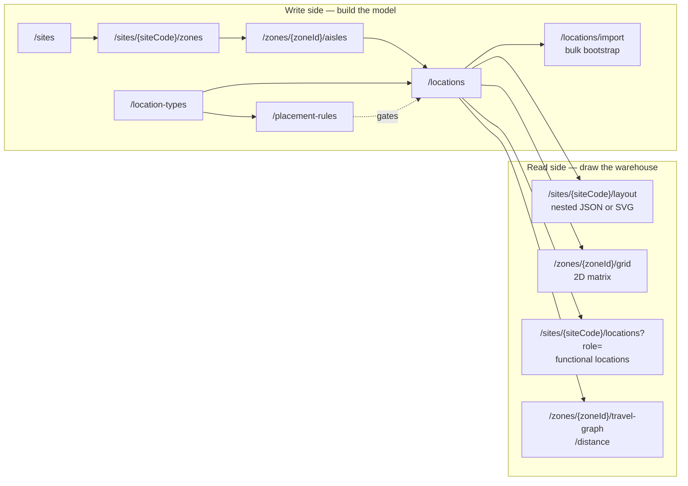

# API Reference

`facility-layout` exposes one HTTP API, documented here. Its message-broker
interface — the Published Language on the `warehouse.facility.events` Kafka
topic — is specified in
[`apis/asyncapi.yaml`](https://github.com/claudioed/facility-layout/blob/main/apis/asyncapi.yaml)
(AsyncAPI 2.6.0) and described on [Domain events](../ddd/domain-events.md);
it has no generated page in this section.

## How this section is organised

| Page | What it is |
|---|---|
| [Conventions](./conventions.md) | REST maturity level 2, RFC 7807 errors, status-code semantics, `Location` headers |
| [Endpoint catalogue](./endpoints.md) | Every route, grouped by OpenAPI tag, cross-checked against the router |
| [Drawing the warehouse](./drawing-the-warehouse.md) | The two headline read endpoints, with real JSON and real SVG output |
| [Bulk import](./bulk-import.md) | `POST /locations/import` and the partial-success report |
| **REST API (from `openapi.yaml`)** | The interactive, per-operation reference **generated from the real specification** — request/response schemas, examples, and a try-it console |

## The generated reference is the source of truth

The pages under **REST API (from `openapi.yaml`)** are generated at build
time by `docusaurus-plugin-openapi-docs` directly from
[`apis/openapi.yaml`](https://github.com/claudioed/facility-layout/blob/main/apis/openapi.yaml)
in this repository — the same ~2,600-line OpenAPI 3.0.3 document that is
linted in CI:

```bash
spectral lint apis/openapi.yaml --ruleset .spectral.yaml --fail-severity=warn
```

Nothing in that section is hand-transcribed, so it cannot drift from the
specification. The hand-written pages in this section exist to explain
*shape and intent* — the things a schema cannot say.

## Base URL and content types

| | |
|---|---|
| Local base URL | `http://localhost:8080` |
| Request bodies | `application/json` |
| Success responses | `application/json`, except `GET /sites/{siteCode}/layout?format=svg` which returns `image/svg+xml` |
| Error responses | `application/problem+json` (RFC 7807), on every error, from day one |
| Authentication | none — this is an internal platform service; `security: []` in the specification |

## The shape of the API in one glance



## Endpoint count

| Group | Paths | Operations |
|---|---:|---:|
| Sites | 2 | 3 |
| Zones | 2 | 3 |
| Aisles | 3 | 5 |
| Location Types | 2 | 3 |
| Placement Rules | 2 | 3 |
| Locations | 5 | 6 |
| Layout | 6 | 7 |
| Health | 1 | 1 |
| **Total** | **23** | **31** |

Every one of the 31 operations the router mounts has a corresponding
operation in `apis/openapi.yaml`. The per-route breakdown — including the two
geometry operations whose specification path differs from the router's — is
on the [Endpoint catalogue](./endpoints.md) page.
