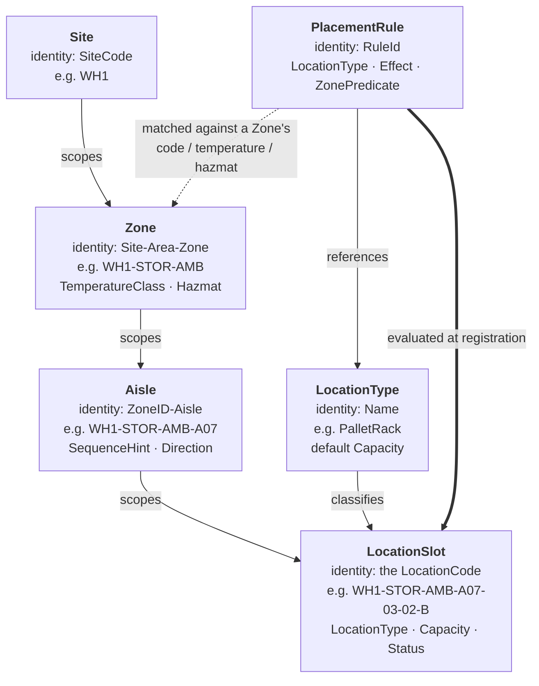

# Aggregates

Six modelling elements make up this context. Four are structural aggregates
in a strict hierarchy; two describe placement legality.



Every aggregate holds only unexported fields, exposes read accessors, and is
constructed through a validating factory. There is no way to obtain an
invalid instance.

## Site

The root of the hierarchy: a physical facility or building.

| | |
|---|---|
| **Identity** | `SiteCode` — non-empty, `[A-Z0-9]` only, unique |
| **State** | `code`, `name`, `status` |
| **Constructor** | `NewSite(code, name string) (*Site, error)` |
| **Rehydration** | `RehydrateSite(code, name string, status shared.Status) *Site` |
| **Behaviour** | `Decommission() error` |
| **Errors** | `ErrEmptySiteCode`, `ErrInvalidSiteCode`, `ErrEmptySiteName`, `ErrAlreadyDecommissioned` |

Uniqueness is enforced at the application/repository layer, not inside the
aggregate: a single aggregate cannot see its siblings, so it cannot police a
global constraint. The aggregate rejects an empty or malformed code; the use
case rejects a duplicate one.

## Zone

A behavioral classification scoped to exactly one Site. It bundles the
LocationCode's **Area** and **Zone** segments into a single aggregate — they
are never independently meaningful, they are always registered together, and
every placement decision needs both, so splitting them would produce an
aggregate that can never be used alone.

| | |
|---|---|
| **Identity** | `ID()` = `SiteCode-AreaCode-ZoneCode`, e.g. `WH1-STOR-AMB` |
| **State** | `siteCode`, `areaCode`, `zoneCode`, `temperatureClass`, `hazmat`, `status` |
| **Constructor** | `NewZone(siteCode, areaCode, zoneCode string, temperatureClass shared.TemperatureClass, hazmat bool) (*Zone, error)` |
| **Behaviour** | `Decommission() error` |
| **Errors** | `ErrEmptySiteCode`, `ErrEmptyAreaCode`, `ErrEmptyZoneCode`, `ErrInvalidCode`, `ErrAlreadyDecommissioned` |

`TemperatureClass` and `Hazmat` are not decoration. They are the fields a
`PlacementRule` predicate matches on, and they are what makes a Zone a
*behavioral* classification rather than a label.

This is the same `Zone` word the WES tier already uses for congestion and
travel-path reasoning. This service becomes its source of truth.

## Aisle

A physical corridor scoped to exactly one Zone.

| | |
|---|---|
| **Identity** | `ID()` = `ZoneID-AisleCode`, e.g. `WH1-STOR-AMB-A07` |
| **State** | `zoneID`, `aisleCode`, `sequenceHint`, `direction`, `status` |
| **Constructor** | `NewAisle(zoneID, aisleCode string, sequenceHint int, direction shared.Direction) (*Aisle, error)` |
| **Behaviour** | `Decommission() error` |
| **Errors** | `ErrEmptyZoneID`, `ErrEmptyAisleCode`, `ErrInvalidAisleCode`, `ErrNegativeSequenceHint`, `ErrAlreadyDecommissioned` |

`SequenceHint` is the walk-order position of the aisle — the concrete
travel-distance input the WES tier needs and previously had nowhere to get.
The layout read model orders aisles by it, not by registration order.
`Direction` (`OneWay`/`TwoWay`) is the second travel input.

## LocationType

A reusable classification of physical slot shape/kind, carrying the default
capacity envelope its slots inherit.

| | |
|---|---|
| **Identity** | `Name` |
| **State** | `name`, `defaultCapacity` |
| **Constructor** | `NewLocationType(name string, defaultCapacity shared.Capacity) (LocationType, error)` |
| **Errors** | `ErrEmptyLocationTypeName`, `shared.ErrInvalidMaxWeight` |

The well-established names from the domain reference are declared as
constants — `PalletRack`, `Shelf`, `ToteWall`, `BulkFloor`, `Staging`,
`Amnesty` — but the type is deliberately **not** an enum:
`RegisterLocationType` accepts any name. Real buildings invent slot kinds,
and a closed enum would force a code change and a redeploy for a rack shape
that the domain does not otherwise care about.

`Amnesty` is a real term from the domain reference: where a damaged or
mismatched item is set aside during stow. It is a physical slot with a shape
and a capacity like any other, so it is a LocationType.

## PlacementRule

A declaration of which LocationTypes are legal in which Zones. Value-typed,
not a pointer aggregate — a rule has no lifecycle beyond existing.

| | |
|---|---|
| **Identity** | `RuleId` |
| **State** | `ruleID`, `locationType`, `effect` (`Allow`/`Deny`), `predicate` |
| **Predicate** | any of `zoneCode`, `temperatureClass`, `hazmat`; every set field must match (AND), unset fields are wildcards, at least one must be set |
| **Errors** | `ErrEmptyRuleID`, `ErrEmptyRuleLocationType`, `ErrUnknownEffect`, `ErrEmptyPredicate` |

`ErrEmptyPredicate` is worth calling out: a rule whose predicate constrains
nothing would match every zone in the building. That is almost always a typo
in a rule definition rather than an intent, so it is rejected at
construction.

A `RuleSet` is the collection of rules applicable to one placement decision.
It is loaded by the use case from the repository and handed to the
`LocationSlot` constructor — an aggregate never reaches outside itself to
query a repository.

```go
// Semantics, in evaluation order:
//
//  1. Any matching Deny rule naming this LocationType rejects it. Deny wins.
//  2. If any matching Allow rule exists for the zone at all, the zone is an
//     allow-list: the LocationType must be named by one of them.
//  3. Otherwise the zone is unconstrained and the placement is permitted.
func (rs RuleSet) Check(locationType string, attrs ZoneAttributes) error
```

## LocationSlot

The leaf aggregate: one coded physical slot. **Its identity is its
LocationCode.**

| | |
|---|---|
| **Identity** | `shared.LocationCode` — globally unique |
| **State** | `code`, `locationType`, `capacity`, `status` |
| **Constructor** | `NewLocationSlot(code, locationType, capacityOverride, attrs, rules) (*LocationSlot, error)` |
| **Behaviour** | `Decommission() error` |
| **Errors** | `ErrMissingLocationCode`, `ErrMissingLocationType`, `ErrZoneMismatch`, `ErrAlreadyDecommissioned`, `placement.ErrPlacementRuleViolated` |

The constructor is the most interesting signature in the domain:

```go
func NewLocationSlot(
	code shared.LocationCode,
	locationType placement.LocationType,
	capacityOverride shared.Capacity,
	attrs placement.ZoneAttributes,
	rules placement.RuleSet,
) (*LocationSlot, error)
```

`attrs` and `rules` are *passed in* rather than looked up. That is Vernon's
"aggregates don't reach outside themselves" discipline applied literally:
the use case resolves the Zone, reads its attributes, loads the applicable
rule set, and hands both to the constructor. The aggregate then enforces:

1. The code is non-zero.
2. The LocationType has a name.
3. `attrs.ZoneID` matches the code's own `ZoneID()` — the caller cannot hand
   in one zone's attributes while registering a slot in another
   (`ErrZoneMismatch`).
4. The capacity envelope resolves: the override if given, otherwise the
   LocationType's default. It must be positive.
5. `rules.Check(...)` passes.

Only then does a `LocationSlot` exist. There is no path that produces an
illegal one.

## Read models are not aggregates

`GetSiteLayout` and `GetZoneGrid` return **projections** assembled by
querying across these aggregates through the repositories. They are not
separately stored state, they emit no events, and they perform no writes.
Because they are derived on read, they cannot go stale relative to the
aggregates they are built from.
