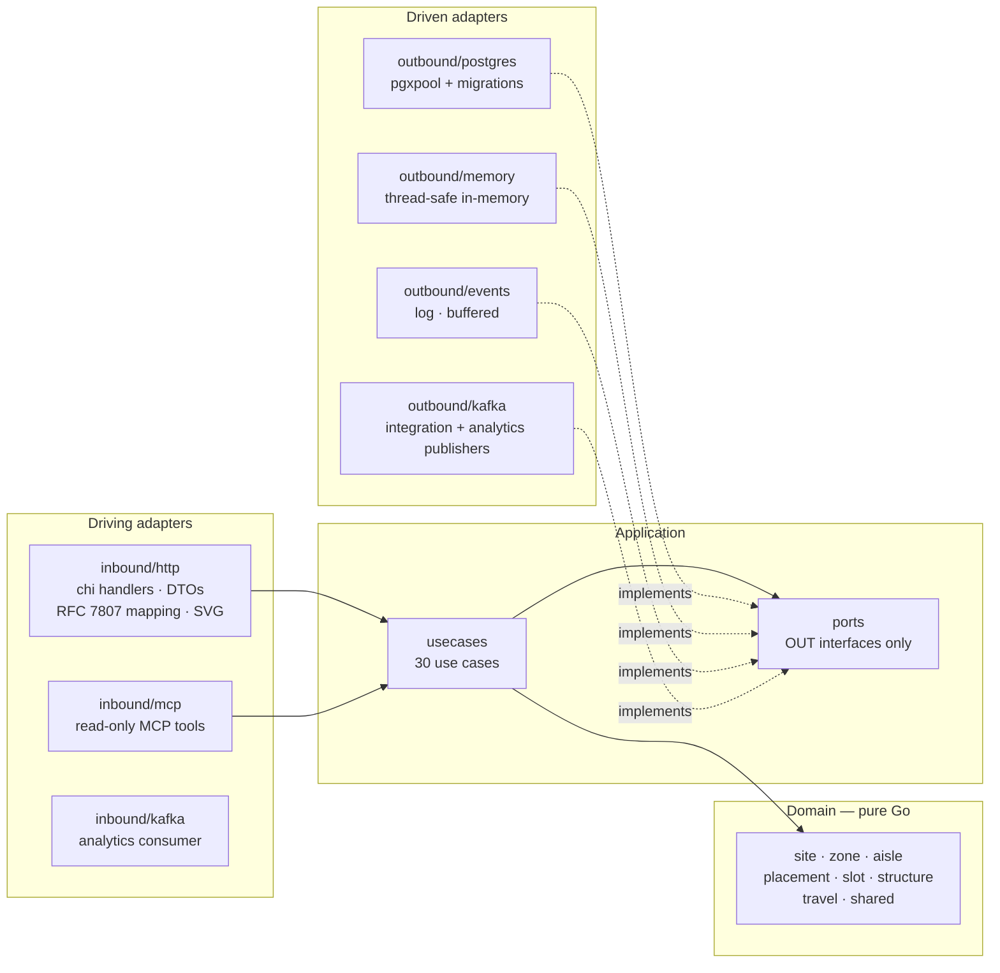

# Hexagonal architecture

Ports and adapters, with one non-negotiable rule:

> **The domain depends on nothing. The application depends on the domain.
> Adapters depend on the application and the domain. Nothing points inward
> from the outside except through a port.**

No framework type, no SQL type, no `net/http` type ever appears in the domain
layer.



The `analytics` read side (`inbound/kafka`, `outbound/analyticsstore`,
`internal/analytics`, `cmd/facility-projector`, `cmd/facility-reports`) is a
separate process pair built on the same event stream; see
[ADR 0010](../adr/0010-analytical-data-product.md).

## Package layout

```
cmd/facility/                 main.go — composition root for the REST service (the only place that knows all layers)
cmd/mcp/                      the read-only MCP server (Streamable HTTP), same use cases
cmd/facility-projector/       analytics projector: warehouse.facility.analytics -> analytical DB
cmd/facility-reports/         analytics reader: serves /reports/catalog-growth
internal/
  domain/                     pure business logic; imports nothing but stdlib and itself
    shared/                   LocationCode, Capacity, geometry values, enums, the 12 events
    site/  zone/  aisle/      the structural aggregates (aisle/ also holds CrossAisle)
    placement/                LocationType, LocationRole, PlacementRule, RuleSet evaluation
    slot/                     LocationSlot — the coded leaf aggregate — and its functional attributes
    structure/                FixedStructure — walls, columns, offices, conveyors
    travel/                   the pure-domain travel graph and shortest-path search
  application/
    ports/                    OUT interfaces only (repos, EventPublisher, Clock, LocationMetrics)
    usecases/                 one struct per use case, including the read-model assemblers
  adapters/
    inbound/http/             chi handlers, DTOs, RFC 7807 error mapping, SVG rendering, reports handler
    inbound/mcp/              MCP tools, resource template and prompt over the read use cases
    inbound/kafka/            analytics topic consumer (projector only)
    outbound/postgres/        pgxpool repos + golang-migrate migrations + events outbox
    outbound/memory/          thread-safe in-memory repos for tests and local runs
    outbound/events/          log + buffered publishers
    outbound/kafka/           integration (warehouse.facility.events) + analytics publishers
    outbound/analyticsstore/  analytical-database projection and report queries
    outbound/telemetry/       OpenTelemetry setup and the LocationMetrics recorder
  analytics/                  the catalog-growth report model
  architecture/               arch-go fitness tests
migrations/                   golang-migrate SQL (migrations/analytics for the analytical DB)
```

## The ports

All eleven are **driven** (outbound) interfaces. There are no inbound port
interfaces: a use case struct *is* the inbound port, called directly by the
HTTP and MCP adapters.

```go
type SiteRepo interface {
	Save(ctx context.Context, s *site.Site) error
	FindByCode(ctx context.Context, code string) (*site.Site, error)
	List(ctx context.Context) ([]*site.Site, error)
}

type ZoneRepo interface {
	Save(ctx context.Context, z *zone.Zone) error
	FindByID(ctx context.Context, id string) (*zone.Zone, error)
	ListBySite(ctx context.Context, siteCode string) ([]*zone.Zone, error)
}

type AisleRepo interface {
	Save(ctx context.Context, a *aisle.Aisle) error
	FindByID(ctx context.Context, id string) (*aisle.Aisle, error)
	ListByZone(ctx context.Context, zoneID string) ([]*aisle.Aisle, error)
}

type SlotRepo interface {
	Save(ctx context.Context, s *slot.LocationSlot) error
	FindByCode(ctx context.Context, code shared.LocationCode) (*slot.LocationSlot, error)
	ListByAisle(ctx context.Context, aisleID string) ([]*slot.LocationSlot, error)
	ListByZone(ctx context.Context, zoneID string) ([]*slot.LocationSlot, error)
}

type CrossAisleRepo     interface { /* Save · FindByAisles · ListByZone */ }
type LocationTypeRepo   interface { /* Save · FindByName   · List */ }
type PlacementRuleRepo  interface { /* Save · FindByID     · List */ }
type FixedStructureRepo interface { /* Save · FindByID     · ListBySite */ }

type EventPublisher interface {
	Publish(ctx context.Context, event shared.DomainEvent) error
}

type Clock interface {
	Now() time.Time
}

type LocationMetrics interface { /* LocationSlotRegistered(ctx, outcome) */ }
```

Note what the port signatures traffic in: **domain types**. `SlotRepo` takes
a `shared.LocationCode`, not a `string`. An adapter cannot hand the
application an unvalidated code, because the type it must supply can only be
produced by the validating constructor.

`Clock` is a port for the same reason: no domain or application code calls
`time.Now()` directly, so every event timestamp is deterministic under test.

## The use cases

Thirty use-case structs live in `internal/application/usecases/`, one per
file group:

| Kind | Use cases |
|---|---|
| Write — thin | `RegisterSite`, `RegisterZone`, `RegisterAisle`, `RegisterLocationType`, `DefinePlacementRule`, `DecommissionLocationSlot` |
| Write — **real orchestration** | **`RegisterLocationSlot`** (full chain of custody + rule set + functional attributes), **`ImportFacilityLayout`** (per-row, partial success) |
| Write — geometry (ADR 0017) | `SetLocationGeometry`, `SetAisleGeometry`, `RegisterCrossAisle`, `RegisterFixedStructure` |
| Read models — no writes, no events | `GetSiteLayout`, `GetZoneGrid`, `GetZoneTravelGraph`, `EstimateTravelDistance`, `ListLocationsByRole` |
| Single-resource and list reads | `GetSite`, `ListSites`, `GetZone`, `ListZones`, `GetAisle`, `ListAisles`, `GetLocationType`, `ListLocationTypes`, `GetPlacementRule`, `ListPlacementRules`, `GetLocationSlot`, `GetLocationClassification`, `ListFixedStructures` |

Only two use cases carry real placement logic. That is intentional: the
invariants live in the domain, and the application layer's job is resolution
and orchestration, not rule-keeping.

## Aggregates do not reach outside themselves

The clearest expression of the discipline is
`slot.NewLocationSlot`'s signature:

```go
func NewLocationSlot(
	code shared.LocationCode,
	locationType placement.LocationType,
	capacityOverride shared.Capacity,
	functional FunctionalAttributes,
	attrs placement.ZoneAttributes,
	rules placement.RuleSet,
) (*LocationSlot, error)
```

The slot must satisfy every applicable `PlacementRule`, but it cannot query a
repository to find them — that would put persistence inside the domain. So
the use case loads the rule set and the zone's attributes and passes them in.
The aggregate stays pure and fully unit-testable with no test doubles at all.

## The rule is a test, not a convention

`internal/architecture/architecture_test.go` uses
[`arch-go`](https://github.com/arch-go/arch-go) to encode the dependency
rule as an executable fitness test. It fails the build if:

- the domain imports anything internal other than the domain,
- the application layer imports anything but the domain,
- an inbound adapter imports an outbound adapter, or vice versa,
- anything other than `cmd` wires every layer together,
- the `ports` package contains anything but interfaces,
- the domain grows a catch-all `utils`/`common` package.

It runs as its own blocking `arch-test` job in CI. A layering violation is
therefore a red build, not a review comment somebody might miss.

## Composition root

`cmd/facility/main.go` is the only file that knows about all the layers. It
reads the environment, picks the adapters, constructs the use cases and
mounts the router:

- `DATABASE_URL` set → Postgres repositories, migrations run at startup, the
  Postgres event publisher.
- `DATABASE_URL` unset → in-memory repositories and the log publisher.
- `EVENT_PUBLISHER=kafka` → independently of the store, the Kafka integration
  and analytics publishers, fanned out together, replace the publisher
  above.

Because the swap happens at exactly one place and every port is an interface
over domain types, the HTTP layer and the entire test suite are identical in
both modes. The BDD suite in `features/` runs the real router over the
in-memory adapters via `httptest.NewServer`, which is only possible because
nothing above the port knows which adapter it got.
