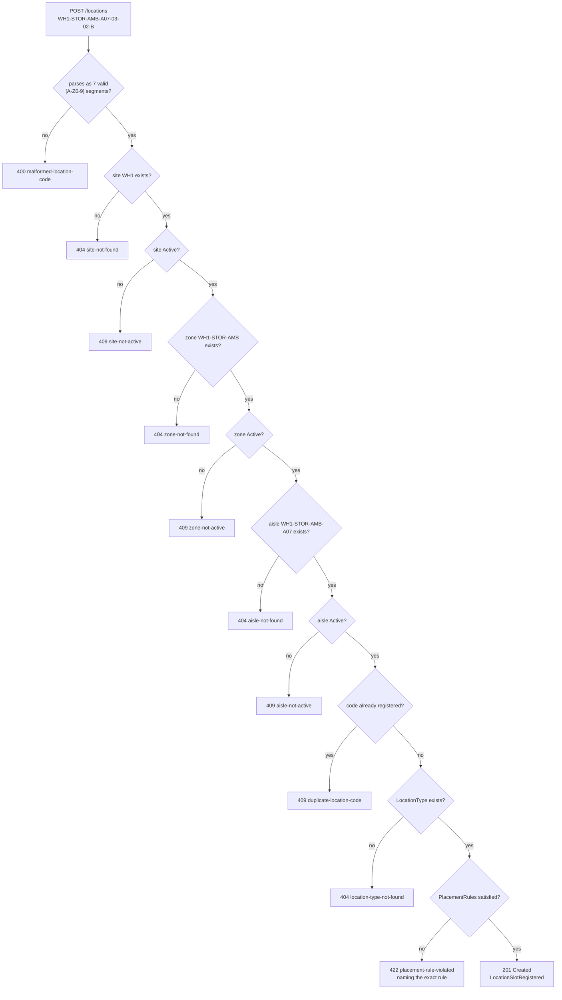

# Invariants

Every rule below is enforced in the domain or the application layer — never
in the HTTP adapter — and every one has a **failing-path** test, not just a
happy-path one.

## The core invariant: no orphan slots, ever

> Registering a `LocationSlot` is a **chain-of-custody check**, not a bare
> insert.

A LocationCode carries its own hierarchy, so the code itself declares which
parents must exist. `RegisterLocationSlot` resolves them in order and rejects
the registration if any link is missing or not `Active`:



Every one of those ten rejection branches is a real test.

## Per-aggregate invariants

### Site

| Invariant | Enforced in | Failure |
|---|---|---|
| `SiteCode` non-empty | `site.NewSite` | `ErrEmptySiteCode` → 400 |
| `SiteCode` is `[A-Z0-9]` only | `site.NewSite` | `ErrInvalidSiteCode` → 400 |
| Name non-empty | `site.NewSite` | `ErrEmptySiteName` → 400 |
| `SiteCode` globally unique | `RegisterSite` use case | `ErrDuplicateSite` → 409 |
| Cannot decommission twice | `Site.Decommission` | `ErrAlreadyDecommissioned` → 409 |

Uniqueness lives in the use case on purpose: a single aggregate cannot see
its siblings, so it cannot enforce a global constraint without reaching
outside itself.

### Zone

| Invariant | Enforced in | Failure |
|---|---|---|
| Scoped to exactly one Site | `zone.NewZone` | `ErrEmptySiteCode` → 400 |
| Area and Zone codes non-empty, `[A-Z0-9]` only | `zone.NewZone` | `ErrEmptyAreaCode` / `ErrEmptyZoneCode` / `ErrInvalidCode` → 400 |
| TemperatureClass is one of Ambient/Chilled/Frozen | `zone.NewZone` | `ErrUnknownTemperatureClass` → 422 |
| Parent Site must exist | `RegisterZone` use case | `ErrSiteNotFound` → 404 |
| **Parent Site must be Active** | `RegisterZone` use case | `ErrSiteNotActive` → 409 |
| `(site, area, zone)` unique | `RegisterZone` use case | `ErrDuplicateZone` → 409 |

### Aisle

| Invariant | Enforced in | Failure |
|---|---|---|
| Scoped to exactly one Zone | `aisle.NewAisle` | `ErrEmptyZoneID` → 400 |
| Aisle code non-empty, `[A-Z0-9]` only | `aisle.NewAisle` | `ErrEmptyAisleCode` / `ErrInvalidAisleCode` → 400 |
| `SequenceHint` non-negative | `aisle.NewAisle` | `ErrNegativeSequenceHint` → 422 |
| Direction is one of OneWay/TwoWay | `aisle.NewAisle` | `ErrUnknownDirection` → 422 |
| Parent Zone must exist | `RegisterAisle` use case | `ErrZoneNotFound` → 404 |
| **Parent Zone must be Active** | `RegisterAisle` use case | `ErrZoneNotActive` → 409 |
| `(zone, aisleCode)` unique | `RegisterAisle` use case | `ErrDuplicateAisle` → 409 |

### LocationType and PlacementRule

| Invariant | Enforced in | Failure |
|---|---|---|
| LocationType name non-empty | `placement.NewLocationType` | `ErrEmptyLocationTypeName` → 400 |
| Default capacity strictly positive | `shared.NewCapacity` | `ErrInvalidMaxWeight` / `ErrInvalidMaxVolume` → 422 |
| LocationType name unique | `RegisterLocationType` use case | `ErrDuplicateLocationType` → 409 |
| Rule id non-empty and unique | `placement` + use case | `ErrEmptyRuleID` → 400 / `ErrDuplicatePlacementRule` → 409 |
| Rule effect is Allow or Deny | `placement.ParseEffect` | `ErrUnknownEffect` → 422 |
| **Rule predicate constrains something** | `placement` | `ErrEmptyPredicate` → 422 |
| **Rule references an existing LocationType** | `DefinePlacementRule` use case | `ErrLocationTypeNotFound` → 404 |

A predicate that sets none of `zoneCode`, `temperatureClass` or `hazmat`
would match every zone in the building. That is almost always a typo, so it
is rejected rather than accepted as a facility-wide rule.

### LocationSlot

| Invariant | Enforced in | Failure |
|---|---|---|
| `LocationCode` is exactly 7 valid segments | `shared.NewLocationCode` / `ParseLocationCode` | `ErrMalformedLocationCode` / `ErrEmptyLocationSegment` / `ErrInvalidLocationSegment` → 400 |
| `LocationCode` globally unique (it **is** the identity) | `RegisterLocationSlot` use case | `ErrDuplicateLocationCode` → 409 |
| Site → Zone → Aisle chain resolves | `RegisterLocationSlot` use case | `ErrSiteNotFound` / `ErrZoneNotFound` / `ErrAisleNotFound` → 404 |
| **Every link in that chain is Active** | `RegisterLocationSlot` use case | `ErrSiteNotActive` / `ErrZoneNotActive` / `ErrAisleNotActive` → 409 |
| Supplied zone attributes match the code's own zone | `slot.NewLocationSlot` | `ErrZoneMismatch` → 422 |
| Capacity envelope strictly positive | `shared.NewCapacity` | `ErrInvalidMaxWeight` / `ErrInvalidMaxVolume` → 422 |
| **Satisfies every applicable PlacementRule** | `slot.NewLocationSlot` via `RuleSet.Check` | `ErrPlacementRuleViolated` → 422, naming the violated rule |
| Cannot decommission twice | `LocationSlot.Decommission` | `ErrAlreadyDecommissioned` → 409 |
| A decommissioned code is never resurrected by re-registration | `RegisterLocationSlot` use case | `ErrDuplicateLocationCode` → 409 |

## Placement-rule evaluation

`RuleSet.Check(locationType, attrs)` runs in a fixed order:

1. Any matching **`Deny`** rule naming this LocationType rejects it. **Deny
   always wins.**
2. If **any** matching `Allow` rule exists for the zone at all, the zone
   becomes an allow-list: the LocationType must be named by one of them, or
   it is rejected.
3. Otherwise the zone is unconstrained and the placement is permitted.

The rejection error always names the specific rule violated:

```
location type violates a placement rule for this zone: PalletRack is denied in
zone WH1-STOR-FRZ by rule [RULE-FRZ-NO-SHELF: Deny PalletRack where
temperatureClass=Frozen]
```

and, for the allow-list branch:

```
location type violates a placement rule for this zone: zone WH1-STOR-HAZ allows
only the location types named by its Allow rules, and Shelf is not among them
(rules: [...])
```

Naming the rule is not cosmetic. During a 500-row bulk import, "rejected" is
useless and "rejected by RULE-FRZ-NO-SHELF" is actionable.

## Lifecycle invariant: decommission is one-way

There is no reactivation use case in v1. A decommissioned Site, Zone, Aisle
or LocationSlot stays decommissioned, and re-registering a decommissioned
LocationCode is rejected as a **duplicate** rather than quietly resurrecting
the slot. The reasoning is recorded in
[ADR 0005](../adr/0005-one-way-decommission.md).

`UnderMaintenance` is a legal persisted state — e.g. loaded from an external
facility-management system — that the read models render. v1 exposes no use
case that sets it, and a slot in it can still be decommissioned.

## Bulk import: atomic per row, never all-or-nothing

`ImportFacilityLayout` applies every invariant above to each row
independently. A row that fails is reported with its index, its location
code and the exact error; the other rows still commit. A 500-row export with
3 bad rows creates the other 497 and tells you precisely which 3 and why.
See [Bulk import](../api-reference/bulk-import.md) and
[ADR 0006](../adr/0006-partial-success-bulk-import.md).

## How these are verified

| Layer | Mechanism |
|---|---|
| Domain | Table-driven unit tests per aggregate, both paths |
| Application | Use-case tests against the in-memory adapters |
| HTTP | One `httptest` per endpoint, asserting status **and** RFC 7807 body |
| End-to-end | godog/Gherkin scenarios over the real HTTP API in `features/` |
| Persistence | Build-tagged Postgres integration tests (skipped without `DATABASE_URL`) |
| Architecture | `arch-go` fitness test — the domain may not import the application layer |

The combined statement coverage gate across `internal/domain/...` and
`internal/application/...` is **≥ 90%**, matching the other four services.
