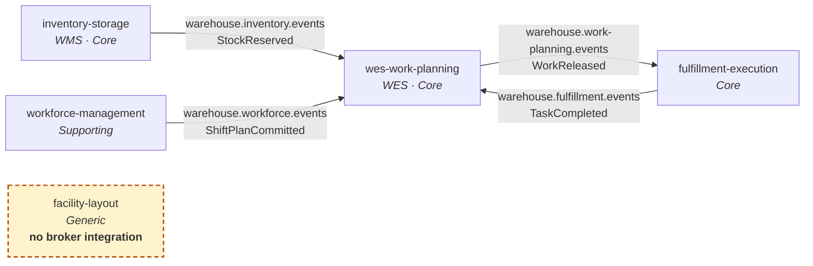
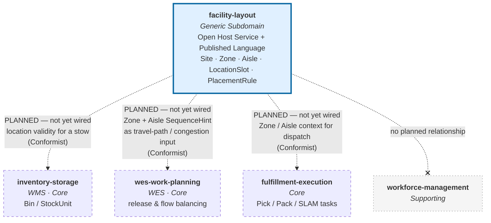

# Context map

:::warning[Read this before the diagrams]
`facility-layout` currently has **zero live integration** with any of the
other four warehouse-systems services. It publishes no Kafka events, consumes
no Kafka events, and has no consumer calling its REST API in production. Its
`EventPublisher` port is backed only by an in-process log publisher, a
buffered test publisher, and a Postgres `events` table.

Everything on this page marked *planned* is a **strategic design decision
that has not been built**. It is documented here because the decision is
real and shapes the service's API; it is flagged everywhere so nobody reads
an intention as an implementation.
:::

## The five services

| Service | Tier | Subdomain | This service's relationship to it |
|---|---|---|---|
| `inventory-storage` | WMS | Core | **Planned consumer** — location validity for `Bin`/`StockUnit` |
| `wes-work-planning` | WES | Core | **Planned consumer** — Zone/Aisle travel-path and congestion input |
| `fulfillment-execution` | — | Core | **Planned consumer** — Zone/Aisle input into task dispatch |
| `workforce-management` | — | Supporting | No planned relationship |
| **`facility-layout`** | WMS-tier concern, extracted | **Generic** | Open Host Service to all of the above |

## What is actually wired today

The four sibling services do integrate with each other over Kafka, on a
shared broker (`~/warehouse-systems/docker-compose.kafka.yml`). That live
topology looks like this — and `facility-layout` is deliberately absent from
it:

`facility-layout` has **no edges** in that diagram. It has no
`internal/adapters/outbound/kafka` package, no `KAFKA_BROKERS` environment
variable, and no `apis/asyncapi.yaml`. That absence is the accurate current
state, not an omission from this page.

## What is planned, and not yet built

The strategic design is settled: this service becomes the **Open Host
Service** for physical-location truth, and the three consumers below become
**Conformists** to its Published Language.

**Every edge in that diagram is dashed and labelled "PLANNED".** None of them
exist in code today, in this repository or in the other four.

### The three planned consumer relationships

| Consumer | What it would consume | Why it needs it |
|---|---|---|
| `inventory-storage` | `LocationSlotRegistered`, `LocationSlotDecommissioned`, or a synchronous `GET /locations/{code}` | A chaotic-storage stow is only valid against a location that exists and is Active. Today `inventory-storage` owns its own `Bin` identity with no external validation; validating it against this service would remove the possibility of stowing into a location that is not on the map. |
| `wes-work-planning` | `ZoneRegistered`, `AisleRegistered` | The WES ubiquitous language already contains `Zone`, `Travel Path` and `Congestion`, but nothing in the platform was the source of truth for the physical facts behind them. An Aisle's `SequenceHint` and `Direction` are the concrete travel-distance inputs that were previously missing. |
| `fulfillment-execution` | `ZoneRegistered`, `AisleRegistered` | Same physical facts, used at dispatch granularity rather than release granularity. |

`workforce-management` stops at the process-path boundary and never links an
associate to a specific location, so it has no reason to consume this
service.

## The strategic relationship, in context-mapping vocabulary

Using Evans/Vernon's patterns as the platform's DDD reference does:

### Open Host Service + Published Language

This service defines an **Open Host Service**: a stable, general-purpose
protocol any number of consumers may use, rather than a bilateral contract
negotiated per consumer. Its **Published Language** is the eight past-tense
[domain events](../ddd/domain-events.md) plus the REST surface, expressed in
its own vocabulary (`LocationCode`, `Zone`, `Aisle`, `LocationType`,
`PlacementRule`).

Two design choices exist to make that language *publishable*:

- `LocationSlotRegistered` denormalises `zoneId` and `aisleId` into the
  payload. A consumer routing on zone must not have to know how to parse this
  context's code format. A Published Language that requires the consumer to
  reimplement the producer's parsing is a leaked internal representation.
- The `EventPublisher` port is a single method,
  `Publish(ctx, event) error` — deliberately the shape a Kafka producer
  satisfies, so adding a broker adapter later is purely additive.

### Conformist, downstream

The consumers are **Conformists**: they accept this context's model rather
than negotiating a shared one, and translate it into their own vocabulary at
their edge. That is the right pattern here precisely *because* this is a
Generic Subdomain — there is nothing to differentiate by modelling location
differently, so conforming costs a consumer nothing and saves everyone a
translation layer.

### No inbound dependency, ever

The most important property of this context map is a non-edge: **nothing
points into `facility-layout` from the other four.** It does not read
`inventory-storage`'s stock. It does not know what a Task, an Assignment, a
Wave or a Shift is. None of them get write access to its aggregates.

A context that everyone depends on has to be cheap to depend on. No coupling
back means no startup ordering constraints, no circular deployment
dependencies, and no cascade beyond a plain read failure.

### Why this is a Generic Subdomain at all

The platform's DDD reference lists, among the disciplines to enforce:

> **Extract generic logic instead of duplicating it.** Cartonization is a
> good example: rather than implementing box-selection logic separately in
> both WMS (for planning/estimates) and WES (at point of pack), model it as
> its own Generic Subdomain both contexts call into.

Physical location is the same case in a different costume: needed by the WMS
tier for stow validity, needed by the WES tier for travel and congestion,
owned by neither. So it is referenced from both rather than duplicated in
either. See [Subdomain classification](../ddd/subdomain-classification.md).

## What would have to be built

For the planned edges to become real, in this repository:

1. An `internal/adapters/outbound/kafka` package implementing
   `ports.EventPublisher`, selected by an `EVENT_PUBLISHER=kafka|log`
   environment variable — the same pattern the four siblings use.
2. A topic — `warehouse.facility-layout.events` would follow the existing
   `warehouse.<service>.events` convention.
3. An `apis/asyncapi.yaml` (AsyncAPI 2.6.0, Spectral-linted) describing the
   envelope and every published event, matching the other four repos.

And, in the consumer repositories, an inbound consumer plus an
anti-corruption translation into their own models. All of that is future,
additive work, explicitly out of scope for this service as built. See
[Consuming this service](./consuming-this-service.md).
