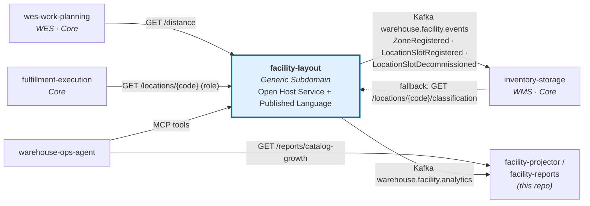

# Context map

:::info[Current state, verified against each repository's `develop`]
`facility-layout` has **no outbound dependency** on any other service: it
calls no one and consumes no other context's events. It is consumed by four
services:

- `inventory-storage` subscribes to its Kafka integration topic
  `warehouse.facility.events` (with `LOCATION_LOOKUP_MODE=kafka`) and can
  fall back to synchronous `GET /locations/{locationCode}/classification`
  (`LOCATION_LOOKUP_MODE=http`).
- `wes-work-planning` calls `GET /distance` for travel distance
  (`TRAVEL_DISTANCE_MODE=http`).
- `fulfillment-execution` calls `GET /locations/{locationCode}` to read a
  location's `role` (`LOCATION_ROLE_MODE=http`).
- `warehouse-ops-agent` calls this context's MCP tools and its
  catalog-growth report REST endpoint.

Every consumer defaults to a `permissive` mode, so none of them needs this
service to start. Relationships that are decided but not built are marked
*planned*.
:::

## The services

| Service | Tier | Subdomain | Relationship to `facility-layout` |
|---|---|---|---|
| `inventory-storage` | WMS | Core | **Live Conformist** — consumes `ZoneRegistered`, `LocationSlotRegistered`, `LocationSlotDecommissioned` from `warehouse.facility.events` to validate stows; `GET /locations/{code}/classification` is the synchronous fallback |
| `wes-work-planning` | WES | Core | **Live Conformist** — `GET /distance?from=&to=` as travel-distance input |
| `fulfillment-execution` | — | Core | **Live Conformist** — `GET /locations/{locationCode}` to resolve a location's functional `role` |
| `warehouse-ops-agent` | — | — | **Live client** — MCP tools `list_sites`, `get_site_layout`, `get_zone_grid`, `estimate_travel_distance`, and the reports service's `/reports/catalog-growth` |
| `workforce-management` | — | Supporting | No relationship |
| **`facility-layout`** | WMS-tier concern, extracted | **Generic** | Open Host Service to all of the above |

## The console: a new, live, browser-facing relationship

Besides the backend consumers above, this service has one **live**
integration outside the backend fleet: `facility-mfe`, a Module Federation
remote owned in this repo's own `web/` directory, calling this service's own
REST API directly from the browser — the read models (sites, layout, grid,
`/distance`) and the configuration writes (sites, zones, aisles, location
types, placement rules, slots, bulk import). It is composed at
runtime by the separate `warehouse-console` shell repo, per
[ADR-0011](../adr/0011-micro-frontend-console-adoption.md), which adopts the
fleet-wide decision recorded in `warehouse-ops-agent`'s
[ADR-0002](https://github.com/claudioed/warehouse-ops-agent/blob/docs/adr-mfe-architecture/docs/docs/adr/0002-micro-frontend-console-architecture.md).

This is **not** a bounded-context relationship in the Evans/Vernon sense —
`warehouse-console` has no domain model and owns no aggregate — but it is a
real, live, additive inbound HTTP surface (browser → this service's existing
REST API, via new CORS middleware) that did not exist before. It is
deliberately **separate** from the "no inbound dependency, ever" property
discussed below: that property is about other *bounded contexts'* backends
never calling into this service's domain on their own terms, which still
holds. A UI client calling this service's own published REST API is the same
category of consumer as any other REST client, browser or not.

`facility-layout` is explicitly **not** one of the four services
`warehouse-ops-agent`'s `console-bff` fans out to for the cross-cutting Order
Lifecycle screen (`order-management`, `inventory-storage`,
`wes-work-planning`, `fulfillment-execution`) — it has no order reference in
its own aggregates. Its role in the console is limited to `facility-mfe`'s
own screen over its own data. See ADR-0011 for the full adoption record.

## What is actually wired today

Arrows point from the side that initiates the interaction. Every arrow
between services goes one of two ways: out of `facility-layout` onto a topic,
or from a consumer into `facility-layout`'s own API. There are no arrows out
of `facility-layout` into another context.

| Consumer | Mechanism | Selected by | What it gets |
|---|---|---|---|
| `inventory-storage` | Kafka consumer (`internal/adapters/outbound/facilitycache`) replaying `warehouse.facility.events` from the first offset on every start | `LOCATION_LOOKUP_MODE=kafka` (enabled in the `warehouse` kind cluster) | Zone temperature class / hazmat and the set of active slot codes, so a stow can be validated without a per-stow HTTP call ([ADR 0013](../adr/0013-first-published-language-consumer.md)) |
| `inventory-storage` | HTTP client, `GET /locations/{code}/classification` | `LOCATION_LOOKUP_MODE=http` + `FACILITY_LAYOUT_BASE_URL` | The same classification, one call per stow — the rollback path |
| `wes-work-planning` | HTTP client (`traveldistance`), `GET /distance?from=&to=` | `TRAVEL_DISTANCE_MODE=http` + `FACILITY_LAYOUT_BASE_URL` | `metresM` and the `estimated` flag between two locations |
| `fulfillment-execution` | HTTP client (`facilitylayout`), `GET /locations/{locationCode}` | `LOCATION_ROLE_MODE=http` + `FACILITY_LAYOUT_BASE_URL` | The slot's `role` (ADR 0016) |
| `warehouse-ops-agent` | MCP client | `FACILITY_LAYOUT_MCP_ENDPOINT` | `list_sites`, `get_site_layout`, `get_zone_grid`, `estimate_travel_distance` |
| `warehouse-ops-agent` | REST client | `FACILITY_LAYOUT_REPORTS_REST_URL` | `/reports/catalog-growth` and `/freshness` from `cmd/facility-reports` |

The remaining nine events on `warehouse.facility.events` are published with
no consumer. `workforce-management` stops at the process-path boundary and
never links an associate to a specific location, so it has no reason to
consume this service.

## What is planned, and not yet built

- **Event-driven travel input for `wes-work-planning`.** It reads distance
  synchronously today. Consuming `AisleRegistered`, `AisleGeometryUpdated`
  and `CrossAisleRegistered` to keep a local travel graph is a design option,
  not code.
- **Cross-zone travel.** `/distance` and `estimate_travel_distance` refuse
  two locations in different zones, because the travel graph does not yet
  connect zones.

## The strategic relationship, in context-mapping vocabulary

Using Evans/Vernon's patterns as the platform's DDD reference does:

### Open Host Service + Published Language

This service defines an **Open Host Service**: a stable, general-purpose
protocol any number of consumers may use, rather than a bilateral contract
negotiated per consumer. Its **Published Language** is the twelve past-tense
[domain events](../ddd/domain-events.md) plus the REST surface, expressed in
its own vocabulary (`LocationCode`, `Zone`, `Aisle`, `LocationType`,
`PlacementRule`).

Two design choices exist to make that language *publishable*:

- `LocationSlotRegistered` denormalises `zoneId` and `aisleId` into the
  payload. A consumer routing on zone must not have to know how to parse this
  context's code format. A Published Language that requires the consumer to
  reimplement the producer's parsing is a leaked internal representation.
- The `EventPublisher` port is a single method,
  `Publish(ctx, event) error` — the shape a Kafka producer satisfies, which
  is why adding the broker adapter
  ([ADR 0009](../adr/0009-kafka-integration-publisher.md)) was purely
  additive.

### Conformist, downstream

The consumers are **Conformists**: they accept this context's model rather
than negotiating a shared one, and translate it into their own vocabulary at
their edge. That is the right pattern here precisely *because* this is a
Generic Subdomain — there is nothing to differentiate by modelling location
differently, so conforming costs a consumer nothing and saves everyone a
translation layer.

### No inbound dependency, ever

The most important property of this context map is a non-edge: **nothing
points out of `facility-layout` into another context.** It does not read
`inventory-storage`'s stock. It does not know what a Task, an Assignment, a
Wave or a Shift is. None of them get write access to its aggregates.

A context that everyone depends on has to be cheap to depend on. No coupling
back means no startup ordering constraints, no circular deployment
dependencies, and no cascade beyond a plain read failure.

### Why this is a Generic Subdomain at all

The platform's DDD reference lists, among the disciplines to enforce:

> **Extract generic logic instead of duplicating it.** Cartonization is a
> good example: rather than implementing box-selection logic separately in
> both WMS (for planning/estimates) and WES (at point of pack), model it as
> its own Generic Subdomain both contexts call into.

Physical location is the same case in a different costume: needed by the WMS
tier for stow validity, needed by the WES tier for travel and congestion,
owned by neither. So it is referenced from both rather than duplicated in
either. See [Subdomain classification](../ddd/subdomain-classification.md).

## Where to go next

How a new consumer should integrate — which endpoint or event, and the rules
it must follow — is on [Consuming this service](./consuming-this-service.md).
